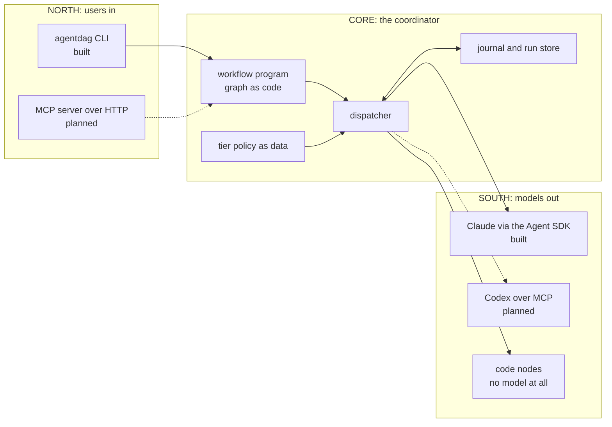
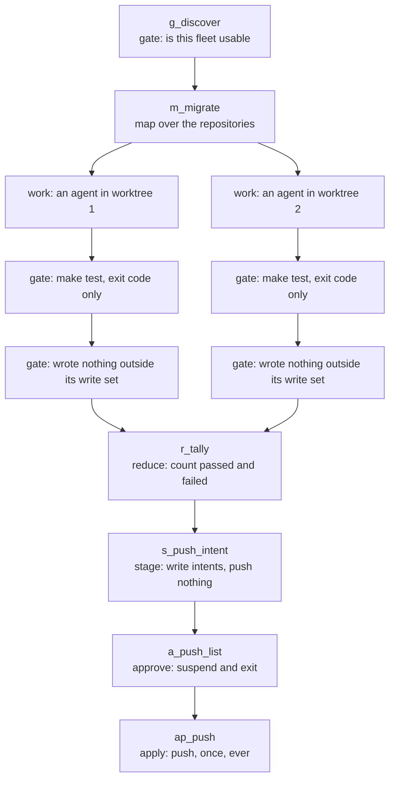

# Architecture overview

**Status:** mixed. The core and the Claude arm are built (M2); the sandbox, the spend cap, the second
executor and the network face are at various distances. Every section below says which.

This is the bird's eye view. It answers each question once, briefly, and points at the document that
carries the detail. For the reasoning behind the shape, read [why agentdag exists](why-agentdag.md)
first; for the commands themselves, the [README](../README.md) is the reference and this document
deliberately does not restate it.

---

## The system in one picture

**Status:** core and south face built (M2); north face is a CLI today, a server later.

agentdag is one program with three faces. Users come in at the north face, models go out at the
south face, and the core in between is a deterministic scheduler that holds records and state but
never content.

The dotted arrows are the parts that are designed and not yet built.

One graph exists today, and drawing it makes the rest of this document concrete. It applies a single
brief to a fleet of repositories, giving each its own worktree, its own agent and its own test run,
and pushing only what passed and only after a person said yes:

Note what is and is not an agent there. Exactly one node per branch is a model. Everything else,
including every step that decides anything, is ordinary code.

---

## 1. How a run is issued and launched

**Status:** built (M2), CLI only.

A run starts with `agentdag run start`, naming a workflow and passing its arguments. The CLI
validates those arguments against the workflow's own typed argument model, mints a run id, creates
the run directory, and then either drives the coordinator in-process or launches it detached and
returns immediately.

Detached means a `systemd --user` scope on Linux when one can actually be created, and a plain child
process in its own process group otherwise. The choice is made by probing, never by trying and
falling back on error, because a scope that should have worked and did not is a condition worth
stopping on rather than papering over. Which one you get decides how completely a cancel or a
deadline can reap the node's grandchildren, so it is not a detail; see
[safety and sandbox](safety-and-sandbox.md).

Four more verbs operate on the run directory afterwards: `status`, `records`, `resume` and `approve`.
That is the whole surface. The CLI is allowed to read the clock and randomness when it mints a run
id; the coordinator itself never may, because determinism is what makes replay possible.

**Not yet:** the network face. The design puts an MCP server over streamable HTTP with a bearer
token in front of the same verbs, so that another tool, including Claude Code itself, can start runs
and answer approvals remotely, and a systemd timer can start them on a schedule. Clients drive and
observe runs; they never submit graphs, because graphs are authored and reviewed in this repository.

## 2. How the user's request and task reach a node

**Status:** built (M2).

Two channels, and they carry different kinds of thing.

Workflow arguments are typed and validated at the CLI boundary: which repositories, which brief file,
which scratch directory. They configure the graph.

The brief is prose, read from a file, and it becomes the node's system prompt. It is the change you
want made, written once, and every agent node in the run receives the same text. There is no
templating engine and no assembled context: a node is told what to do by its brief alone. What it
gets besides that is its own working directory, its model and effort resolved from the tier policy,
a fixed short first instruction, and nothing else.

That "nothing else" is deliberate and it is stronger than it sounds. See section 11.

## 3. How information passes between nodes

**Status:** built (M2).

Not by talking. Nodes never message each other, and there is no shared conversation they all append
to.

A node returns a typed record: a status from a closed vocabulary, references to artefacts it wrote,
a small map of key facts, and the names of the fields in that map a caller is allowed to trust. The
content it produced stays on disk. The next node that needs the content reads the file; the
coordinator, which passes the record along, never reads the content at all.

This is the "records, not content" rule from [why agentdag exists](why-agentdag.md), and it is what
keeps the one context every node passes through from filling up with everything every node said.

## 4. How results come back

**Status:** built (M2).

The executor streams the agent's messages, writes them to a transcript, and builds the record from
the structured metadata the run reports: turn count, error flag, token usage. The model's free text
is not parsed for structure and does not become the result.

Code nodes build their record directly, with genuinely typed facts in it: a gate's record carries the
exit code, an isolation scan's carries the list of paths that should not exist.

One refusal is worth knowing about. A node that reports success while naming no artefact and no
typed fact has produced nothing the coordinator can branch on, so its record is rewritten as a
failure. Confidence with nothing attached to it is treated as an empty result, not a result.

Detail in [the execution model](execution-model.md).

## 5. How the graph's shape is decided, and altered while it runs

**Status:** built (M2) for data-driven shape; the planner node is designed and deliberately deferred.

A workflow is an ordinary Python program that calls the coordinator's primitives as functions. There
is no graph object compiled up front and then walked. That means the shape can depend on data the run
discovers: the fleet migration does not know how many branches it has until a discovery step reads
the list, and then fans out one branch per repository.

Dependencies between nodes are declared, but they do not decide order. Program control flow does.
What a declared dependency does is fold that dependency's result into the downstream node's identity,
so that a changed upstream result changes every key beneath it. That is a replay property, not a
scheduling one.

**Not yet:** a `planner` node, whose output is the specification of the next nodes rather than a piece
of work. It is designed, including the validation a planner's emission has to pass before anything is
dispatched from it, and it is gated behind scoring a batch of real planner emissions first. Until
that data exists, re-planning means a program branching on typed fields, which covers more than it
sounds like it does.

## 6. What runs a node: Claude, Codex, other models

**Status:** Claude built (M2); Codex planned (M4); other model families planned behind the same port.

There is one executor port and adapters behind it. Today one adapter exists. A Claude node is a child
process running the same Claude Code binary a person runs interactively, driven headlessly through
the Agent SDK, one process per node, with its own credential.

Codex is the second arm, planned as one `codex mcp-server` per node. It reaches parity on most of
what the coordinator needs and misses on two, so the design compensates rather than pretending: it
reports no usage in its result, so the node's whole budget is charged at dispatch and reconciled
afterwards from the log Codex writes; and it has no in-node cap signal, which is the same reason.

Other model families reach the same port as an MCP server plus a per-vendor field map. The vendors'
agent-as-a-tool surfaces are dialects rather than one protocol, which is why the port is the boundary
and the field map is per adapter.

Full comparison, including which side of each row is built, in
[executors and models](executors-and-models.md).

## 7. What a node may touch, and what stops it

**Status:** partial (M2). Enforcement is real but limited, and the limits are measured, not guessed.

A node works in its own worktree. It declares a write set. Two tool hooks refuse edits that resolve
outside its isolation root and refuse a list of forbidden shell commands. After the node finishes, a
scan compares the whole run tree before and after and fails the branch on anything it wrote that
nobody declared.

For the one graph that exists, a further rule applies: a run never writes to a real repository. It
works on bare mirrors made once, and neither the mirror nor the worktree keeps a remote, so a reflex
push has nowhere to go.

**Not yet, and stated plainly because it matters:** none of this is containment. A node runs as the
same operating system user as the coordinator, so its shell can read anything that user can read and
can reach the network. The command denylist blocks the exact shapes it lists and demonstrably not
their variants. The write-set check happens after the write, not instead of it.
[Safety and sandbox](safety-and-sandbox.md) is the honest, complete version.

## 8. Crash, resume and human approval

**Status:** built (M2).

Every dispatch is identified by a content hash over what makes the call what it is: the node's
identity fields, its brief, its assembled input, and the results of everything it depends on. The
journal records a line before the body runs and a line after it returns.

That gives resume for free and gives it precisely. A crash leaves exactly the nodes whose result line
never landed without a result; the next launch re-dispatches those and serves every other node's
record from the journal without running anything. A replay of a finished run dispatches nothing at
all.

Human approval uses the same mechanism rather than blocking a process. An approve node writes its
payload, the run's status becomes suspended, and the process exits. A person records a decision; the
run relaunches and picks up where it stopped. A decision is bound to the exact payload it answered,
so if the question changed while the run was suspended, the old answer no longer matches and the run
asks again instead of silently applying it.

Detail in [the execution model](execution-model.md).

## 9. Cost and limits

**Status:** partial (M2). Measurement is built; enforcement is M3.

Token usage is measured per turn and per node and accumulated per model row across the run, and it is
in the record and the run summary. A turn ceiling per node exists.

**Not yet:** a cap that fires. Budgets are declared on nodes, per-row ceilings are declared in the
policy, and a budget-exceeded error type exists, but nothing refuses a dispatch or interrupts a node
yet. The seam is in place and the mechanism is M3: check the streamed per-turn usage and interrupt
when the row's cap is passed, accepting one turn of overshoot rather than pretending it can be zero,
and refuse the next dispatch when the run-level cap is reached.

One cost note that shapes graphs rather than limiting them: starting an agent costs roughly the same
whatever you send it, so a node has to be worth the greeting. The design's rule of thumb is that an
agent node carries at least the work a person would spend ten minutes on, and there is a primitive
for folding many small items into one dispatch when they would not.

## 10. Sandbox mode

**Status:** port only (M3, in flight). One adapter, and it declares that it isolates nothing.

Nodes run behind a sandbox port. Today exactly one adapter is wired, and its guarantees are three
booleans, all false: no filesystem boundary, no egress control, no separate user. Those booleans are
stamped onto every node's record, so the isolation a piece of work ran under is a journaled fact
rather than a claim in a README.

That is the point of shipping it as a no-op first. It names today's behaviour honestly and puts the
seam where a real boundary will attach.

**Not yet:** a container per node, with its own home, its own mounts, and its own network namespace
with egress denied by default and allowed only to the model API. It comes ahead of the other M3
mechanisms because egress is the hole that was actually measured. A VM per node is the step after
that. A separate operating system user per node was considered and decided against: it costs more
than the container for the filesystem half and delivers nothing at all for the network half.

## 11. Claude Code, subagents and the self-improve loop

**Status:** partial. The isolation is built (M2); knowledge grants and the self-improve graph are
planned.

A dispatched node does not inherit your Claude Code setup. Not your hooks, not your CLAUDE.md
cascade, not your skills, not your plugins. The executor asks for no setting sources at all and gives
the node its own configuration directory and a true environment allowlist, blanking everything else
rather than omitting it.

That is deliberate on two counts. It is the "accessible is not loaded" rule made concrete: a node is
told what to do by its brief, and pulls what it needs rather than starting under everything the
operator happens to have installed. And it is a cost decision, because loading a full operator plugin
set into every dispatch multiplies what each node pays before it does anything.

What a node gets instead of your hooks is agentdag's own, enforcing its isolation root and its
command denylist.

**Not yet:** the retrieval half of the same rule, as knowledge grants naming which datasets a node may
reach, which waits on work in the semantic index that has not shipped. And the self-improve and
memory-consolidation loop expressed as a graph of its own, which today runs as a subagent fan-out and
already demonstrates what a coordinator would fix about it: a parallel writer clobbering a sibling's
target, no journal, no resume, no cap.

Detail in [Claude Code integration](claude-code-integration.md).

---

## Where to go next

| Question                                               | Document                                              |
|--------------------------------------------------------|-------------------------------------------------------|
| Why is it shaped this way at all                       | [why agentdag exists](why-agentdag.md)                |
| What is a node, a record, a key, a replay              | [execution model](execution-model.md)                 |
| How a model is actually driven, and which models       | [executors and models](executors-and-models.md)       |
| What stops a node doing damage, today and later        | [safety and sandbox](safety-and-sandbox.md)           |
| Hooks, knowledge, subscriptions, the self-improve loop | [Claude Code integration](claude-code-integration.md) |
| Which commands exist and what they take                | [README](../README.md)                                |
