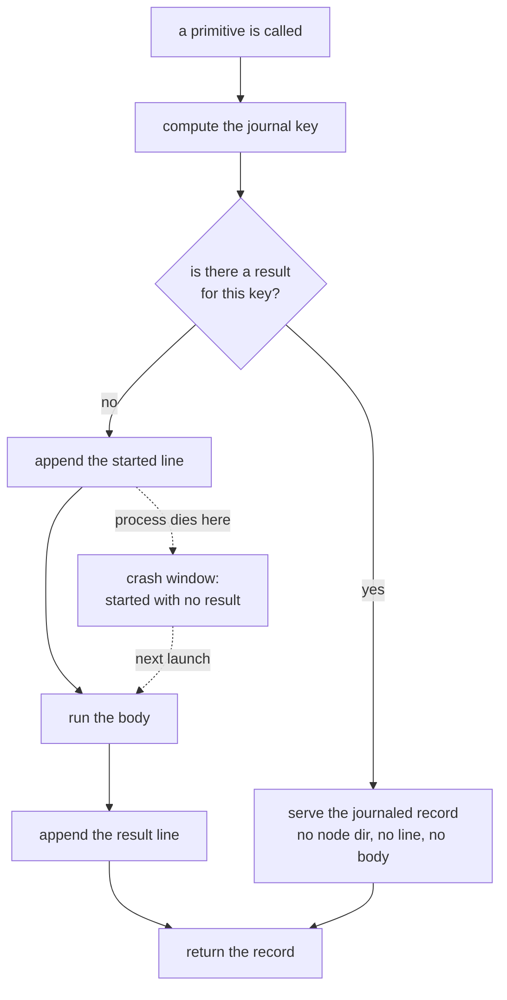

# Execution model

**Status:** built (M2) except where a section says otherwise. This is the core the rest of the system
hangs off: what a node is, what it returns, how that is recorded, and what happens when the machine
dies in the middle.

---

## 1. A node

**Status:** built (M2).

A node is one dispatched unit of work. It carries an identifier, a kind, the executor and model tier
it wants, the knowledge datasets it may reach, the paths it declares it will write, the resources it
needs, its isolation mode, its dependencies, a deadline, a budget, and two counters for retry and
continuation.

The kinds are a closed vocabulary. `work` and `synth` and `planner` are model nodes. `gate`, `reduce`,
`map`, `stage`, `apply`, `wait`, `batch` and `approve` are not: they are ordinary code, and some of
them are not even dispatched to anything, they just fold or fan out.

The vocabulary being closed is the point. A coordinator that branches on free text branches on
whatever a model felt like writing.

## 2. A record is the only thing the coordinator sees

**Status:** built (M2).

Every node, whatever ran it, returns the same shape: a status from a closed set, references to
artefacts it wrote, a map of key facts, the names of the fields in that map that are meant to be
trusted, its token usage, what was charged to which model row, which executor and model and effort
actually ran, which knowledge it used, and an error when there is one.

The status vocabulary is `done`, `failed`, `blocked`, `needs_context`, `needs_continuation`,
`refused` and `cancelled`. The error types are similarly closed. A coordinator can branch on those
safely because they cannot drift into prose.

Two things deliberately do not appear in a record. The model's answer, which stays in the transcript
and in whatever files it wrote. And any judgement about whether the work was good, which is a gate's
job and not a record's.

One rule is enforced at the boundary rather than trusted: a record claiming `done` while naming
neither an artefact nor any of its own declared typed fields is rewritten to a failure with an
"empty result" error. A node that says it succeeded and hands back nothing to branch on has, from the
coordinator's point of view, produced nothing.

## 3. The journal key: what makes a call the same call

**Status:** built (M2).

Each dispatch is identified by a content hash. Everything that makes the call what it is goes in: the
node's identity fields, the hash of its brief, the hash of its assembled input, and, chained in
order, the record hashes of everything it depends on.

Three exclusions are deliberate and each one is a decision.

The raw list of dependency names is out, because a dependency contributes its *result* to identity,
not its name. Including both would count it twice, and it is the result that actually matters: if an
upstream node returns something different, everything downstream of it is a different call.

The deadline and the budget are out, because they bound a call rather than defining it. Raising a
deadline should not orphan a completed result.

The brief's file path is out, but its content is in. Where the text lives is not identity; the text
is.

Two consequences follow. A node whose inputs are unchanged has the same key across runs, which is
what makes replay exact. And two different nodes that genuinely are the same call share one key, so
the second is served the first's record without running: that is deduplication working, not a
collision.

## 4. The journal

**Status:** built (M2).

Two files, both append-only, both owner-readable only. Every line is one JSON object with sorted keys
and an ISO-8601 UTC timestamp. The audit copy is written and flushed first, then the journal, each
with its own open, write, flush and sync. That ordering gives one guarantee and only one: the journal
is never ahead of the audit copy.

Six kinds of line: a run started, a resume with its reason, a node started, a node's result, a human
decision, and a run summary. Nothing else is state. There is a `state.json` beside the journal for
convenience, but it is derived, and the journal is what a replay reads.

## 5. Replay, the crash window, and what resumable actually buys

**Status:** built (M2).

Folding the journal in one pass gives everything a relaunch needs: the results already recorded, the
keys that have a started line and no result, the decisions already made, and the exact sequence of
keys the last run dispatched.

The crash window is the gap between the two lines, and it is exactly one node wide per node in
flight. A process killed there leaves a started line with no result; the next launch finds no result
for that key and runs the body again, in the same node directory as the attempt that died, so
whatever the dead attempt wrote is still there for the retry to use. Everything else is served from
the journal and does not run.

That gives a testable property rather than a promise, and it is the one the kernel is checked
against: kill a run between the started and result lines of one node, resume, and exactly that node
is re-dispatched. Replay a finished run and nothing is dispatched at all.

The same property has a second use as an oracle. Because every call appends its key to a list before
the index is consulted, a replay that serves everything must produce the same multiset of keys the
journal's own started lines already hold. If it does not, the workflow program is not deterministic,
and that is caught rather than discovered later.

**Not yet:** a failed code node is final in this version. Its record is served from the journal on
every resume and no command mints a new attempt, so a run that failed on a gate can only be started
again as a new run. The retry path is M3.

## 6. Suspend and resume: a human decision as control flow

**Status:** built (M2).

An approve node does not block. It writes its payload, and if no decision exists for that exact
payload it raises a suspension, which the driver treats as control flow rather than an error: the
run's status becomes suspended, the cursor records which node is waiting, and the process exits.

A person records a decision. The next launch folds any new decision files into the journal and finds
the answer where the approve node looks for it.

The lookup is keyed by the node and the hash of the payload, never by the node alone. That is what
makes the mechanism trustworthy across a gap in time. If anything about the question changed while
the run was suspended, the payload hashes differently, the old decision does not match, and the run
suspends again on the new question rather than quietly applying an answer to something else.

Two more guards sit around it. A decision file is write-once per node and payload, published by
linking a fully written temporary file into place, so there is never a half-written or overwritten
decision. And a payload whose default option would cause an external side effect is refused at
validation: a default the coordinator may apply unattended must never itself be the destructive
option.

**Not yet:** the timer that applies a payload's default when a deadline passes, and the notification
that tells someone a run is waiting. Both are M3. Today a suspended run waits until a person looks.

## 7. Side effects: stage, apply, and doing it once

**Status:** built (M2).

External effects are split in two. A `stage` node writes an intent describing what should happen and
performs nothing. An `apply` node performs intents, each guarded by a marker file named for the
intent's deduplication key and touched only after the effect succeeded.

That ordering is what makes a crash survivable in the one place it really matters. An effect either
has not happened, or has happened and is marked. A crash between the effect and the marker leaves the
marker missing, so the next run tries again, which is why the effect itself also re-checks external
state before acting: the fleet migration re-reads the target and skips a push that is already there.

There is one more check at the same point, and it exists because of section 6. Immediately before
performing, the applier re-reads what it is about to act on and compares it to what the intent named.
If it moved since the person approved it, nothing happens. That is where "the human approved this
exact thing" is actually cashed out.

## 8. The primitives

**Status:** mixed. The ones the shipped graph uses are built; the rest are specified.

| Primitive | What it is                                                | Status              |
|-----------|-----------------------------------------------------------|---------------------|
| `work`    | fresh context, one contained task, returns a record       | built               |
| `gate`    | non-AI check, exit code, failure stops the branch         | built               |
| `map`     | fan out over N items, one isolation each                  | built               |
| `reduce`  | deterministic fold over records                           | built               |
| `stage`   | write an intent for an external effect                    | built               |
| `apply`   | perform intents, idempotent on replay                     | built               |
| `approve` | suspend with a typed payload, resume by decision          | built               |
| `synth`   | fresh context reading the store, forms a judgement        | specified           |
| `planner` | a synth whose output is the next node specifications      | specified, deferred |
| `wait`    | poll external state with a bound                          | specified           |
| `batch`   | fold N small items into one dispatch                      | specified           |
| `compact` | an executor compresses its own history, a field on `work` | specified           |

Some patterns deliberately are not primitives, because they are control flow in the workflow program
and inventing a node kind for them would buy nothing: repeat until a gate passes, repeat until a
round adds nothing new, pick a sub-graph by a typed field, take N independent judgements and let code
count them.

A judging `reduce` is a mistake worth naming. A fold that decides something by weighing evidence is a
`synth`, which is a model node with a record; `reduce` is arithmetic.

## 9. Parallelism, and the rule for when it is allowed

**Status:** built (M2), bounded by one run-wide limit.

`map` is the only fan-out. Its branches run concurrently under a single semaphore created once per
run, so two maps running at the same time still admit the configured number of branches between them
rather than that many each. Everything outside a map is serial by construction.

The plan-time rule is the one from [why agentdag exists](why-agentdag.md): branches may run in
parallel when they share no mutable artifact. In the shipped graph that is true structurally, since
every branch owns its own worktree, and the graph refuses to start on a fleet where two members would
collide.

Serialisation for a shared resource is done at the resource, not by the scheduler. The test gate is
the example: every gate run in the system takes one host-wide lock, because the build tool
environment is shared across the machine and two gates would rebuild it under each other. So the
parallel setting bounds agent nodes, not gates.

**Not yet:** a general resource registry. Node specifications can already declare what they require
and the policy table can already describe resources with capacities and probes, but nothing consumes
either yet. One lock, enforced directly, is what exists.

## 10. The run lifecycle

**Status:** partial (M2).

A run is running, and ends suspended, done or failed. Suspended means an approve node is waiting and
the process exited on purpose. Failed means the workflow raised. Done means it returned, and the
launch appends a run summary.

A raw process death writes nothing, which is the point: the state file still says running and a
started line still has no result, and that pair is precisely how the next launch recognises a crash.

**Not yet:** cancelling, cancelled and crashed exist in the vocabulary and nothing sets them. Cancel
as an operation, and the deadline that would kill a node's scope and record a deadline error, are M3.
Whether either can reap a node's grandchildren depends on how the coordinator was launched; see
[safety and sandbox](safety-and-sandbox.md).

## 11. The tier policy

**Status:** built (M2) for resolution; the ceilings it declares are not enforced yet.

Which model runs a node is data, not code. A policy file lists model rows, each with an alias, the
executor that runs it, a cost rank, the roles it can serve, the efforts it allows, its prices, and
whether it bills against a subscription or a meter. A node asks for a role rather than a model, and
resolution picks the cheapest available row that serves that role. Naming a model explicitly is
allowed and is checked against the same table.

The file is content-hashed and the hash is the policy version recorded with the run, so it is always
possible to say which table a decision was made under. Two knobs deliberately live outside the file,
in ordinary configuration, so that raising a turn ceiling does not move the policy version.

The table also carries what the design calls thresholds and run limits: a floor on how much work
justifies a dispatch, a fan-in width for reduce trees, a journal size to watch, a ceiling on
continuations, per-row token ceilings for a whole run, and a deadline ceiling. They are loaded and
reported on. Enforcing them is M3.

**Not yet:** escalation. The rule for retrying a node one rank up, and what to do when there is no
higher row, is described in the policy shape and is not implemented.

## 12. The context ceiling and the handover

**Status:** planned. Designed in full, not built.

"One contained task per node" bounds a node's context structurally, but it does not bound it over
time. A long node grows its own context turn by turn until attention degrades, which is the failure
[why agentdag exists](why-agentdag.md) is written around.

The designed answer is a ceiling with a deterministic handover rather than a summary. The coordinator
can read a node's context size exactly after every turn, from what the executor reports. At a
threshold it stops the node, which writes a typed handover record: what is done, what is left, the key
facts, the artefact paths, the state of its write set. The node ends with a continuation status, and
the coordinator dispatches a successor with the same brief plus that record, in the same worktree, on
the same budget, with a continuation counter that becomes part of the successor's journal key.

The reason for the typed record, rather than letting the harness compact prose, is that the
coordinator has to be able to branch on it and a replay has to be able to reproduce it. A prose
summary is neither.

The threshold is per model row rather than global, because it depends on the row's window and on the
task, and it starts conservative.

---

## Where to go next

- [Executors and models](executors-and-models.md) is what happens inside a `work` node's body.
- [Safety and sandbox](safety-and-sandbox.md) is what bounds a node while that body runs.
- [Architecture overview](architecture-overview.md) puts this back in context.
